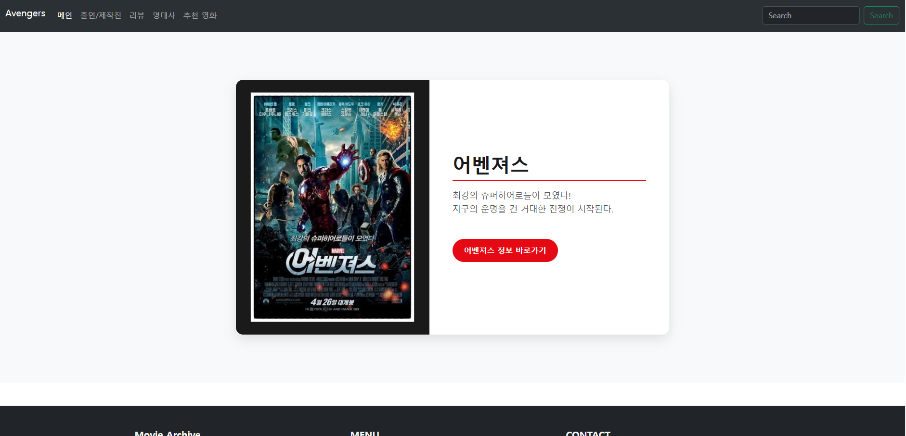

# 🎬 Avengers Movie Community

Spring Boot와 Spring Data JPA를 활용하여 제작한  
**영화 「어벤져스」 정보 및 커뮤니티 웹 사이트**입니다.

사용자는 어벤져스의 영화 정보와 출연진·제작진을 확인하고, 추천 영화를 검색하거나 리뷰와 명대사를 등록하여 다른 사용자와 공유할 수 있습니다.

---

# 📖 프로젝트 소개

Avengers Movie Community는 영화 「어벤져스」를 주제로 제작한 팀 프로젝트입니다.

Spring Boot 기반의 MVC 구조와 Spring Data JPA를 적용하여 영화 정보 조회, 출연진 검색, 추천 영화 조회, 리뷰 게시판, 댓글, 명대사 게시판 등의 기능을 구현했습니다.

Thymeleaf Layout을 이용해 Header와 Footer를 공통 레이아웃으로 구성했으며, Bootstrap과 CSS를 활용해 페이지 간 통일된 화면을 구현했습니다.

### 메인 화면



---

# 🛠 사용 기술

## Backend

- Java 25
- Spring Boot 4.1.0
- Spring MVC
- Spring Data JPA
- Hibernate
- Lombok
- Thymeleaf

## Frontend

- HTML5
- CSS3
- JavaScript
- Bootstrap 5

## Database

- Oracle Database 21c XE
- Oracle JDBC Driver

## 기타

- Git
- GitHub
- Thumbnailator

---

# 👥 팀원 정보

| 팀원  | 담당 기능 | 주요 역할                                             |
|-----| --- |---------------------------------------------------|
| 김태현 | 출연진·제작진 | 출연진·제작진 목록 조회, 배우·제작진 분리, 이름·배역·직무 검색, 카드 UI 구현   |
| 육현승 | 메인·추천 영화·공통 화면 | 메인 화면, 추천 영화 목록·검색·페이징·상세 조회, 공통 Header·Footer 구성 |
| 이상경 | 리뷰·댓글 | 리뷰 CRUD, 검색, 페이징, 비밀번호 확인, 첨부파일, 댓글 CRUD 및 페이징    |
| 김성민 | 명대사 | 명대사 CRUD, 검색, 추천(좋아요), 페이징 처리                     |

---

# 📂 페이지 구성

- 메인 페이지
- 출연진·제작진 페이지
- 추천 영화 목록 페이지
- 추천 영화 상세 페이지
- 리뷰 목록 페이지
- 리뷰 작성 페이지
- 리뷰 상세 페이지
- 리뷰 수정 페이지
- 명대사 목록 페이지

---

# ✨ 주요 기능

## 📌 메인 페이지

- 어벤져스 포스터와 영화 소개 출력
- 출연진·제작진 페이지 이동
- 공통 Header와 Footer 적용
- 각 기능 페이지 Navigation 제공

---

## 📌 출연진·제작진

- 출연진과 제작진 전체 목록 조회
- `ACTOR`와 `CREW` 값에 따라 화면 영역 분리
- 인물 이름 검색
- 배역 및 담당 직무 검색
- 출력 순서에 따른 정렬
- 인물 사진과 정보를 카드 형식으로 출력
- 이미지가 없는 인물에 기본 프로필 이미지 적용
- 검색 결과가 없을 때 안내 메시지 출력

### 검색 처리

```text
검색어 없음
→ 전체 출연진·제작진 조회

검색어 있음
→ 인물 이름 또는 배역·직무에 검색어가 포함된 데이터 조회

조회 결과
→ ACTOR와 CREW 목록으로 분리하여 화면에 출력
```

---

## 📌 추천 영화

- 추천 영화 목록 조회
- 추천 영화 페이징 처리
- 영화 제목 검색
- 출연 배우 검색
- 추천 영화 상세 정보 조회
- 목록 페이지로 돌아가기
- 영화 포스터 및 영화 정보 출력

### 검색 항목

| 검색 조건 | 검색 대상 |
| --- | --- |
| 영화 제목 | `movieName` |
| 출연 배우 | `movieCast` |

---

## 📌 리뷰 게시판

- 리뷰 목록 조회
- 리뷰 작성
- 리뷰 상세 조회
- 리뷰 수정
- 리뷰 삭제
- 조회수 증가
- 제목 검색
- 작성자 검색
- 내용 검색
- 리뷰 목록 페이징
- 비밀번호 확인 후 수정 및 삭제
- 이미지 첨부파일 업로드
- 첨부파일 변경
- 파일 저장 예외 처리

### 리뷰 검색 항목

| 검색 조건 | 검색 대상 |
| --- | --- |
| 제목 | 리뷰 제목 |
| 작성자 | 작성자 닉네임 |
| 내용 | 리뷰 본문 |

### 리뷰 처리 흐름

```text
리뷰 작성
→ DTO 데이터 수신
→ Entity 변환
→ 첨부파일 저장
→ Repository를 통해 DB 저장
→ 리뷰 목록으로 이동
```

---

## 📌 리뷰 댓글

- 리뷰별 댓글 목록 조회
- 댓글 등록
- 댓글 수정
- 댓글 삭제
- 최신 댓글 순으로 정렬
- 댓글 목록 페이징
- JavaScript Fetch API를 이용한 비동기 통신

### 댓글 API

| HTTP Method | 요청 주소 | 기능 |
| --- | --- | --- |
| GET | `/review/{reviewNo}/comments` | 댓글 목록 조회 |
| POST | `/review/{reviewNo}/comments` | 댓글 등록 |
| PUT | `/review/comments/{id}` | 댓글 수정 |
| DELETE | `/review/comments/{commentNo}` | 댓글 삭제 |

---

## 📌 명대사

- 명대사 목록 조회
- 명대사 등록
- 명대사 수정
- 명대사 삭제
- 명대사 추천수
- 제목 검색
- 캐릭터 및 배우 이름 검색
- 페이지당 5개씩 페이징 처리
- 검색 결과 목록 페이징

### 검색 처리

```text
검색어 입력
→ 명대사 제목 또는 캐릭터·배우 이름 검색
→ 검색 결과를 Page 객체로 변환
→ 페이지 단위로 화면에 출력
```

---

# 🗂 데이터 구성

## Cast

출연진과 제작진 정보를 저장합니다.

| 필드 | 설명 |
| --- | --- |
| `castId` | 출연진·제작진 식별 번호 |
| `castName` | 인물 이름 |
| `roleName` | 배역 또는 담당 직무 |
| `castType` | 배우 또는 제작진 구분 |
| `imagePath` | 프로필 이미지 경로 |
| `displayOrder` | 화면 출력 순서 |

```text
ACTOR → 출연진
CREW  → 제작진
```

---

## RecommendMovie

추천 영화 정보를 저장합니다.

| 필드 | 설명 |
| --- | --- |
| `movieNo` | 영화 식별 번호 |
| `movieName` | 영화 제목 |
| `movieDirector` | 감독 |
| `movieCast` | 출연 배우 |
| `movieContent` | 영화 소개 |
| `movieImage` | 영화 이미지 정보 |

---

## Review

리뷰 게시글 정보를 저장합니다.

| 필드 | 설명 |
| --- | --- |
| `reviewNo` | 리뷰 번호 |
| `reviewTitle` | 리뷰 제목 |
| `reviewName` | 작성자 |
| `reviewContent` | 리뷰 내용 |
| `reviewPassword` | 수정·삭제 확인용 비밀번호 |
| `reviewCreateAt` | 작성일 |
| `reviewHit` | 조회수 |
| `savedFileName` | 서버에 저장된 파일명 |
| `originFileName` | 원본 파일명 |

---

## ReviewComment

리뷰에 등록된 댓글 정보를 저장합니다.

| 필드 | 설명 |
| --- | --- |
| `id` | 댓글 번호 |
| `nickname` | 댓글 작성자 |
| `commentBody` | 댓글 내용 |
| `createdDate` | 댓글 작성일 |
| `review` | 댓글이 작성된 리뷰 |

---

## MemorableLines

명대사 게시글 정보를 저장합니다.

| 필드 | 설명 |
| --- | --- |
| `memoNo` | 명대사 게시글 번호 |
| `characterActorName` | 캐릭터 및 배우 이름 |
| `title` | 제목 |
| `content` | 내용 |
| `createTime` | 작성일 |
| `good` | 추천 수 |

---

# 🏗 프로젝트 구조

```text
src
├── main
│   ├── java
│   │   └── com.team.project.avengers
│   │       ├── common
│   │       │   ├── config
│   │       │   ├── dto
│   │       │   ├── exception
│   │       │   └── util
│   │       ├── controller
│   │       ├── dto
│   │       ├── entity
│   │       ├── repository
│   │       └── service
│   │
│   └── resources
│       ├── static
│       │   ├── css
│       │   ├── image
│       │   └── js
│       │
│       ├── templates
│       │   ├── avengers
│       │   │   ├── review
│       │   │   ├── cast.html
│       │   │   ├── main.html
│       │   │   ├── memorableList.html
│       │   │   ├── recommendDetail.html
│       │   │   └── recommendList.html
│       │   │
│       │   └── layout
│       │       ├── fragments
│       │       │   ├── config.html
│       │       │   ├── footer.html
│       │       │   └── header.html
│       │       └── layout.html
│       │
│       └── application.properties
│
└── test
    └── java
        └── com.team.project.avengers
```
# 🔗 주요 요청 주소

| 페이지 | 요청 주소 |
| --- | --- |
| 메인 | `/avengers/main` |
| 출연진·제작진 | `/avengers/cast` |
| 추천 영화 | `/avengers/recommendlist` |
| 추천 영화 상세 | `/avengers/recommendDetail/{movieNo}` |
| 리뷰 목록 | `/review/list` |
| 리뷰 작성 | `/review/write` |
| 리뷰 상세 | `/review/{reviewNo}` |
| 명대사 | `/avengers/memorableList` |

---

# 🌿 Git 브랜치 전략

기능별 브랜치를 생성하여 개발한 후 `main` 브랜치에 병합하는 방식으로 협업했습니다.

## 브랜치 구성

```text
main
cast
review
memorableLines
avengersRecommend
```

## 작업 흐름

```text
기능 브랜치 생성
→ 기능별 코드 작성
→ Commit 및 Push
→ main 최신 코드 병합
→ 충돌 확인 및 해결
→ 기능 테스트
→ main 브랜치에 최종 병합
```

---

# 👨‍💻 담당 역할 및 구현 내용

## 김태현

### 출연진·제작진 페이지

- 출연진·제작진 Entity 설계
- Repository 조회 및 검색 메서드 구현
- Entity를 화면용 DTO로 변환
- 출연진과 제작진 목록 분리
- 인물 이름 검색
- 배역 및 담당 직무 검색
- 출력 순서 정렬
- 인물 사진 카드 UI 구현
- 이미지가 없는 인물을 위한 기본 프로필 이미지 적용
- 검색 결과 없음 처리

---

## 육현승

### 영화 추천 페이지

- 영화 추천에 필요한 Entity 설계
- Main페이지 구현
- header와 footer 레이아웃 구성
- 페이징 처리를 통한 리스트 화면 구현
- 영화 제목과 감독 이름을 통한 검색 기능 구현
- 리스트 썸네일 ui구현
- 리스트 클릭시 영화정보가 나오는 Detail페이지 구현

---

## 김성민

### 영화 명대사 페이지

- 영화 명대사 등록 및 조회
- 영화 명대사 수정 및 삭제
- 캐릭터/배우 또는 명대사 키워드 검색
- 페이지네이션을 통한 게시글 목록 관리
- 추천(좋아요) 기능
- 필수 입력값 유효성 검사

---

## 이상경

### 영화 리뷰 페이지
- 리뷰와 댓글 관련 Entity 설계
- 리뷰 조회 및 검색어를 활용한 검색 기능 구현
- 리뷰 조회시 조회수 증가 기능 구현
- 리뷰, 댓글 조회시 최신순으로 정렬하는 기능 구현
- JavaScript Fetch API를 활용하여 리뷰 수정, 삭제 기능 구현
- 리뷰, 댓글 수정, 삭제시 경고 알림창 구현(필수 정보 미입력시 경고 알림)
- 댓글 수정, 삭제 기능 구현
- 페이지네이션을 활용한 페이징 기능 구현(리뷰, 댓글)
- 리뷰 등록, 수정시 사진 파일 업로드(수정) 기능
- 비밀번호 확인 기능

---
